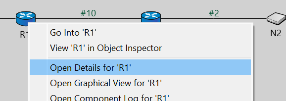
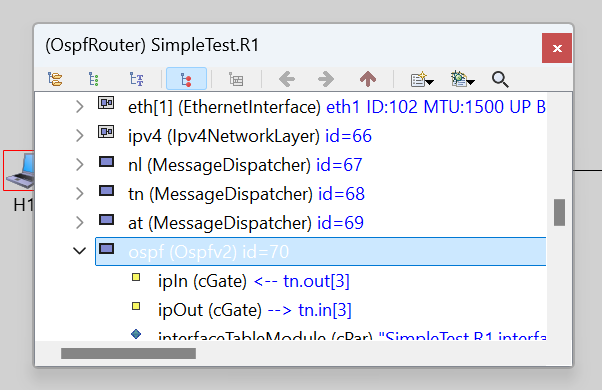
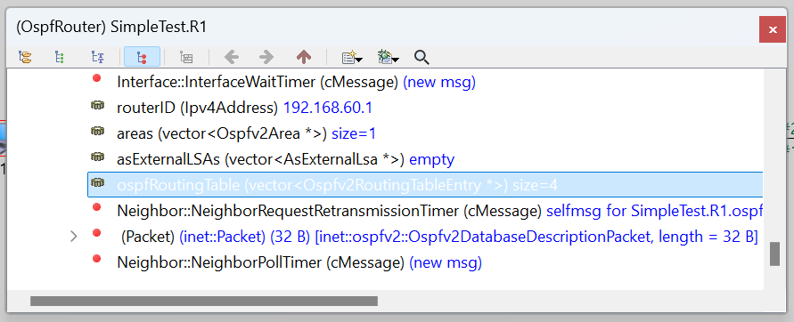
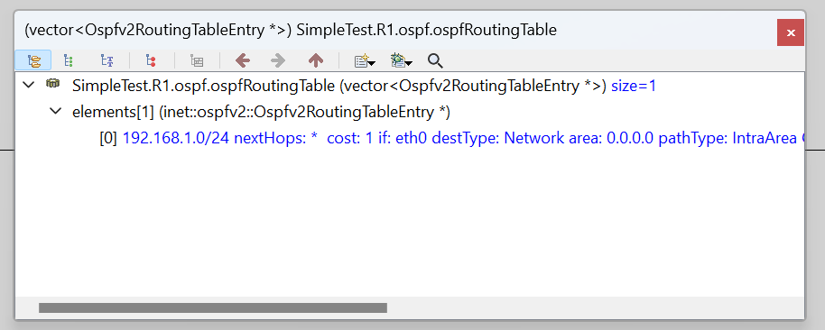
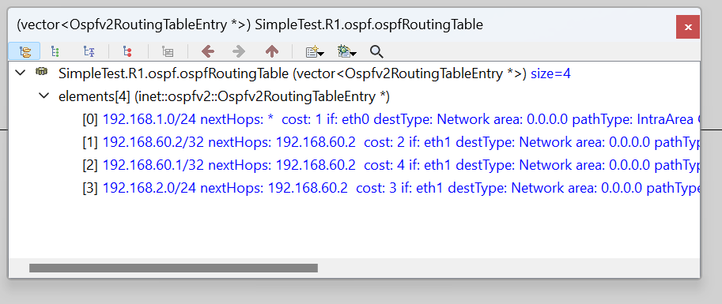
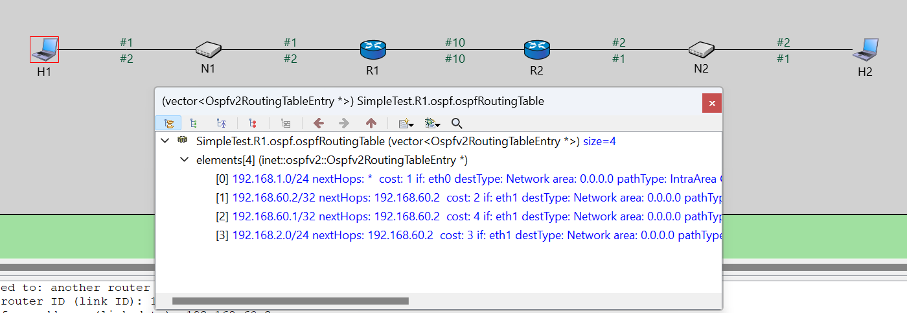
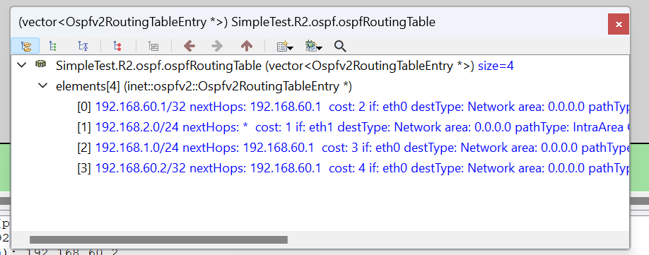
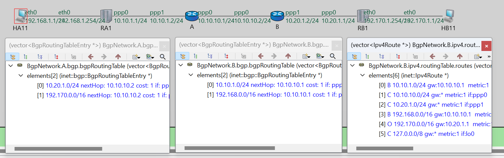
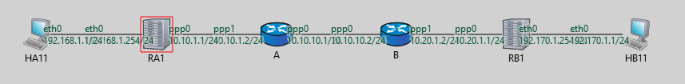

- [检查过程](#检查过程)
  - [OSPF](#ospf)
  - [RIP](#rip)
  - [BGP](#bgp)
- [原理（检查无关但便于理解）](#原理检查无关但便于理解)
  - [OSPF](#ospf-1)
    - [补充说明](#补充说明)
    - [相关文章](#相关文章)
    - [专有名词](#专有名词)
    - [过程](#过程)
    - [Qusetion](#qusetion)
  - [RIP](#rip-1)
    - [原理](#原理)
    - [过程](#过程-1)
  - [BGP](#bgp-1)
    - [原理](#原理-1)
    - [过程](#过程-2)
    - [Qusetion](#qusetion-1)

## 检查过程
### OSPF
- 首先打开 inet/examples/ospfv2/simpletest
- run ini 文件，configuration 为 General
- 右键 R1，open details 
  
- 拉到最下面打开ospf 表项
  
- 找到ospfroutingtable
  
  初识table应为：
  
- 开始模拟，过程中表项个数增加，直到最后有四个表项
  
- 重新观察链路：
  
  **不需要解释routingtable怎么找到，只需要解释的是H1发的包怎么寻路到H2**
  **注意双击R1能打开端口信息**
  **注意实际上查找ip都是找ipv4的routing table，ipv4 routing table 会根据ospf的routing table实时更新**
  H1 (192.168.1.0/24) 首先判断目标 ip (192.168.2.0/24) 是否在同一个子网内；
  发现不在，故直接发向默认网关，即R1 。
  R1 收到包后，查找routing table，发现条目 3，于是发向 R2 (192.168.60.2)
- 现在看 R2 的routing table
  
  发现表项 1，nexthops 为*，代表不需要经过任何路由器，直接在子网内找到目标主机 H2

### RIP 
太简单了，故助教没问，Pass
### BGP
- 首先打开 inet/examples/bgpv4/BGPAndOspfSimple
- run ini 文件
- 模拟过程同OSPF，只是需要观察的是BGP的routing table
- 链路图如下：
  
- 解释过程：
  - HA11 (192.168.1.1/24) 发包给 HB11 (192.170.1.1/24)，发现不在同一个子网内，故发给默认网关 RA1
  - RA1 通过 ppp (不同于 eth，不需要mac地址，所以不需要查找routing table) 直接发给 A
  - A 查找routing table，发现表项 1，nexthops 为 10.10.10.2，故发给 B
  - B 查找routing table，找不到，代表在当前bgp组网内。故查找 ipv4 的routing table，发现表项4，故发给网关 10.20.1.1 ，发到RB1
  - RB1 发给子网内的 HB11。
## 原理（检查无关但便于理解）
### OSPF 
Open Shortest Path First
LS: Link State
特点
- 洪泛法：向AS内所有路由器发送链路状态信息
- 消息：相邻路由器之间交换链路状态信息
- 时机：链路状态发生变化时，向所有路由器发送链路状态信息

#### 补充说明
- 重放攻击：
  伪造路由器：伪造路由器向其他路由器发送虚假的链路状态信息 

- 传播方式：
  - 单播：向单个目的地址发送数据包
  - 广播：向所有主机发送数据包， MAC = FF:FF:FF:FF:FF:FF
  - 多播：向一组主机发送数据包，MAC = 01:00:5E:00:00:00~01:00:5E:7F:FF:FF，这组网卡接受某一段MAC

#### 相关文章
- [OSPF 技术连载](https://mp.weixin.qq.com/s?__biz=MzIyMzIwNzAxMQ==&mid=2649451529&idx=1&sn=8bad953e36ba959e367dd2727bc408f1&chksm=f03e0705c7498e13ca1499e061950f770956e0af72bd956624ece4aea2b83b2a2aa78f178b37&cur_album_id=3009995382978510852&scene=189#wechat_redirect)
- [官方RFC文档](https://www.rfc-editor.org/rfc/rfc2328)
- [机翻RFC文档](https://rfc2cn.com/rfc2328.html)

#### 专有名词
- DR : Designated Router 在 OSPF 网络中某一选定的路由器，负责向其他路由器发送链路状态信息
- IFG: Inter-frame Gap 帧间间隔
- AS: Autonomous System 自治域

#### 过程


master ip : 192.168.60.2
slave ip : 192.168.60.1
- 通过 Interface 向外发送 Hellopacket 消息
  发送给所有OSPF主机
  多播地址：
  - IP 224.0.0.5 
  - MAC 01:00:5E:00:00:05
  因为OSPF主机收到多播地址的数据包后，ip层不会forward，所以不会向外发送，表现为只有物理邻居收到
- 收到 Hello 消息后，将邻居 ip 地址状态从 down 变为 init
- 通过 Interface 向 slave 邻居发送DDpacket: LSA (Link State Advertisement)
  本机记录邻居状态从init -> exchangestart
  slave 收到后向 master 同样发送DDpacket ,状态从 init -> exchangestart
  "三次握手" 
  - master -> slave: `ddOptions=I M MS LSAHeader 空`
  - slave -> master: `ddOptions=I M MS LSAHeader 空`
  - master -> slave: `ddOptions=I M MS LSAHeader 空`
- 协商主从： **Router ID 较大的为 Master，较小的为 Slave**
  `The initialize(I), more (M) and master(MS) bits are set,  the contents of the packet are empty, and the neighbor's Router ID is larger than the router's own.  In this case the router is now Slave.  Set the master/slave bit to slave, and set the neighbor data structure's DD sequence number to that specified by the master.`
- exchangestart -> exchange
  首先 slave -> master 发送 DDpacket,   更新状态 exchange
  ```
  ddOptions=_ _ __
  LSAHeader (age: 0, type: RouterLsa, LSID: **192.168.60.1**, advertisingRouter: 192.168.60.1, seqNumber: -2147483646)
  ```
  **LSID 源ID**

  然后 master -> slave 发送 DDpacket, 更新状态 exchange
  ```
  ddOptions=_ _ MS
  LSAHeader (age: 0, type: RouterLsa, LSID: 192.168.60.2, advertisingRouter: 192.168.60.2, seqNumber: -2147483646)
  ```
  master 同步发送LSRpacket (Link State Request)
  ```
  type=1, LSID=192.168.60.1, advertisingRouter=192.168.60.1
  ```
  **LSID 目的ID**
- exchange -> loading
  slave 收到 exchange最后一条packet,发送DDpacket,更新状态 loading
  ```
  ddOptions=_ _ __ 
  LSAHeader 空
  ```
  同步发送LSRpacket
  ```
  type=1, LSID=192.168.60.2, advertisingRouter=192.168.60.2
  ```

  master收到DDpacket后,发送DDpacket,更新状态 loading
  ```
  ddOptions=_ _ __
  LSAHeader 空
  ```
- loading 态
  slave 收到 LSRpacket ,发送LSUpacket
  ```
  LSAHeader (age: 1, type: RouterLsa, LSID: 192.168.60.1, advertisingRouter: 192.168.60.1, seqNumber: -2147483646)
  =_ _ _
  links:
  ID=192.168.1.0, data=4294967040 (255.255.255.0), type= Stub , cost=1
  ```
  master 收到LSUpacket,发送LSUpacket
  ```
  LSAHeader (age: 1, type: RouterLsa, LSID: 192.168.60.2, advertisingRouter: 192.168.60.2, seqNumber: -2147483646)
  bits=_ _ _
  links:
  ID=192.168.2.0, data=4294967040 (255.255.255.0), type= Stub , cost=1
  ```
- loading -> full
  slave 收到LSUpacket,发送LSUpacket
  ```
  LSAHeader (age: 1, type: RouterLsa, LSID: 192.168.60.1, advertisingRouter: 192.168.60.1, seqNumber: -2147483645)  
  bits=_ _ _  
  links:  
  ID=192.168.1.0, data=4294967040 (255.255.255.0), type= Stub, cost=1  
  ID=192.168.60.2, data=3232250881 (192.168.60.1), type= PointToPoint, cost=2  
  ID=192.168.60.2, data=4294967295 (255.255.255.255), type= Stub, cost=2  
  ```
  slave 本机routinng table结果:
  ```
  Results:
  destination = 192.168.1.0, prefixLength = 24, nextHop = <unspec>, metric = 1, interface = eth0
  destination = 192.168.60.2, prefixLength = 32, nextHop = 192.168.60.2, metric = 2, interface = eth1
  ```

  master 收到LSUpacket,发送LSUpacket
  ```
  LSAHeader (age: 1, type: RouterLsa, LSID: 192.168.60.2, advertisingRouter: 192.168.60.2, seqNumber: -2147483645)
  bits=_ _ _
  links:
  ID=192.168.60.1, data=3232250882 (192.168.60.2), type=PointToPoint, cost=2
  ID=192.168.60.1, data=4294967295 (255.255.255.255), type=Stub, cost=2
  ID=192.168.2.0, data=4294967040 (255.255.255.0), type=Stub, cost=1
  ```
  同时每次发送LSUpacket后,slave和master都会更新自己的routing table

- full 态 process
  slave 收到LSUpacket,判断不需要发送LSUpacket

- Aging
  每隔 1s 对LSA进行aging, 一旦超过 30s?, 重新建立连接

#### Qusetion
- 为什么要设置master/slave
- metric和cost的区别 20 VS 2
- cost 怎么选择

### RIP
Routing Information Protocol 
DV: Distance Vector
#### 原理
- 每隔30s向相邻路由器发送路由表信息
- 通过UDP协议发送
- 上限15跳
- 存在路由环路问题,无穷计数问题
- metric 可**自定义**

#### 过程
- A 发送RIP request
- B 收到RIP request,发送RIP response
  - 初始化时ip-mac对应表为空,所以需要ARP请求,RIP response 进入 pending 状态
    `ARP req: 192.168.60.2=? (s=192.168.60.1(0A-AA-00-00-00-03))`
  - A收到ARP request后,更新 arp cache
    `Updating ARP cache entry: 192.168.60.1 <--> 0A-AA-00-00-00-03`
    发送ARP reply
    `ARP reply: 192.168.60.2=0A-AA-00-00-00-04 (d=192.168.60.1(0A-AA-00-00-00-03))`
  - B收到ARP reply后,更新arp cache,发送RIP response
- A收到RIP response,更新routing table
  `Adding new route destination = 192.168.1.0, prefixLength = 24, nextHop = 192.168.60.1, metric = 2, interface = eth0`


### BGP
Border Gateway Protocol

#### 原理
- IGP: Interior Gateway Protocol 如 RIP, OSPF
- icmp：Internet Control Message Protocol


#### 过程

HA:192.168.1.1 -> HB:192.170.1.1
- 正常ospf过程
- HA 发送arp请求
  `inet::EthernetMacHeader, length = 14 B | ARP req: 192.170.1.1=? (s=192.168.1.1(0A-AA-00-00-00-03)) | inet::EthernetFcs, length = 4 B`
  RA1: arp cache miss，发送当前网关mac地址
  `ARP reply: 192.170.1.1=0A-AA-00-00-00-01 (d=192.168.1.1(0A-AA-00-00-00-03))`
- HA 收到arp reply，发送udp basic packet
- A 收到udp basic packet，但是routing 192.170.1.1失败，故发送icmp packet
  ICMP-error-#1-type3-code0
  但是routing 192.168.1.1 也失败，故drop
- 继续ospf过程，A接收RA1的LSU packet，更新routing table
- 现在能发icmp packet了，HA 收到icmp packet了
  但是app层忽略error
  `Ignoring UDP error report ERROR`

BGP 过程
- B 启动监听tcp 179端口 (BGP专用端口)
  ```
  BgpNetwork.B.tcp.conn-11: Initializing module BgpNetwork.B.tcp.conn-11, stage 0
  Tcp connection created for (inet::Request)PassiveOPEN
  BgpNetwork.B.tcp.conn-11: Connection <none>:-1 to <none>:-1  on socketId=11  in INIT
  BgpNetwork.B.tcp.conn-11: App command: OPEN_PASSIVE
  BgpNetwork.B.tcp.conn-11: Starting to listen on: 10.10.10.2:179
  BgpNetwork.B.tcp.conn-11: Transition: INIT --> LISTEN  (event was: OPEN_PASSIVE)
  ```
  发送tcp packet，syn
  `inet::PppHeader, length = 5 B | inet::Ipv4Header, length = 20 B | inet::tcp::TcpHeader, 0->179 [Syn] Seq=4000000 Win=14336, length = 24 B | inet::PppTrailer, length = 2 B`

- A 收到syn，但还未启动监听，发送 rst + ack
  `inet::PppHeader, length = 5 B | inet::Ipv4Header, length = 20 B | inet::tcp::TcpHeader, 179->0 [Ack=4000001 Rst] Seq=0 Win=0, length = 20 B | inet::PppTrailer, length = 2 B`
- B 收到rst + ack，关闭连接
- A 启动监听tcp 179端口
  ```
  BgpNetwork.A.tcp.conn-9: Initializing module BgpNetwork.A.tcp.conn-9, stage 0
  Tcp connection created for (inet::Request)PassiveOPEN
  BgpNetwork.A.tcp.conn-9: Connection <none>:-1 to <none>:-1  on socketId=9  in INIT
  BgpNetwork.A.tcp.conn-9: App command: OPEN_PASSIVE
  BgpNetwork.A.tcp.conn-9: Starting to listen on: 10.10.10.1:179
  BgpNetwork.A.tcp.conn-9: Transition: INIT --> LISTEN  (event was: OPEN_PASSIVE)
  ```
  发送syn
- B 收到syn，发送syn + ack
- A 收到 syn + ack，建立连接，发送ack + bgp open Message
  ```
  My AS: 65324
  Hold time: 180s
  BGP Id: 10.10.10.1
  Optional parameters: empty
  ```
- B 收到 ack，发送 open Message
  ```
  My AS: 65248
  Hold time: 180s
  BGP Id: 10.10.10.2
  Optional parameters: empty
  ```
- B 收到open Message，发送 `BGP Keep-alive message`
- A 收到open Message，发送 `BGP Keep-alive message`
- B 收到keep-alive message，发送 `BGP Update Message`
  ```
  Withdrawn routes: empty
  Path attribute 1: [len:4]
    AS_PATH: 65248
  Path attribute 2: [len:4]
    NEXT_HOP: 10.10.10.2
  Path attribute 3: [len:1]
    ORIGIN: INCOMPLETE
  Network Layer Reachability Information (NLRI):
    NLRI length: 24
    NLRI prefix: 10.20.1.0
  ```
  ```
  Withdrawn routes: empty
  Path attribute 1: [len:4]
    AS_PATH: 65248
  Path attribute 2: [len:4]
    NEXT_HOP: 10.10.10.2
  Path attribute 3: [len:1]
    ORIGIN: INCOMPLETE
  Network Layer Reachability Information (NLRI):
    NLRI length: 16
    NLRI prefix: 192.170.0.0
  ```
- A 收到keep-alive message，发送 `BGP Update Message`
  ```
  Withdrawn routes: empty
  Path attribute 1: [len:4]
    AS_PATH: 65324
  Path attribute 2: [len:4]
    NEXT_HOP: 10.10.10.1
  Path attribute 3: [len:1]
    ORIGIN: INCOMPLETE
  Network Layer Reachability Information (NLRI):
    NLRI length: 24
    NLRI prefix: 10.10.1.0
  ```
  ```
  Withdrawn routes: empty
  Path attribute 1: [len:4]
    AS_PATH: 65324
  Path attribute 2: [len:4]
    NEXT_HOP: 10.10.10.1
  Path attribute 3: [len:1]
    ORIGIN: INCOMPLETE
  Network Layer Reachability Information (NLRI):
    NLRI length: 16
    NLRI prefix: 192.168.0.0
  ```
- B 收到update Message，更新routing table
  ```
  BgpNetwork.B.ipv4.routingTable: add route B 10.10.1.0/24 gw:10.10.10.1  metric:1  if:ppp0 origin: INCOMPLETE ASlist: 65324
  BgpNetwork.B.ipv4.routingTable: add route B 192.168.0.0/16 gw:10.10.10.1  metric:1  if:ppp0 origin: INCOMPLETE ASlist: 65324
  ```
- A 收到update Message，更新routing table
  ```
  BgpNetwork.A.ipv4.routingTable: add route B 10.20.1.0/24 gw:10.10.10.2  metric:1  if:ppp0 origin: INCOMPLETE ASlist: 65248
  BgpNetwork.A.ipv4.routingTable: add route B 192.170.0.0/16 gw:10.10.10.2  metric:1  if:ppp0 origin: INCOMPLETE ASlist: 65248 
  ```
- ipv4 routing table 同样实时更新。现在能完整routing了
- 最后需要RB1 -> HA11的arp请求，得到mac地址，才能发送udp packet
#### Qusetion
- 为什么HA11的arp不能直接走ppp
- 为什么HA11 -> RA1的udp能直接走ppp
- 为什么只有在host和router之间才需要arp
  maybe因为ppp是点对点，eth共享介质才需要mac标识